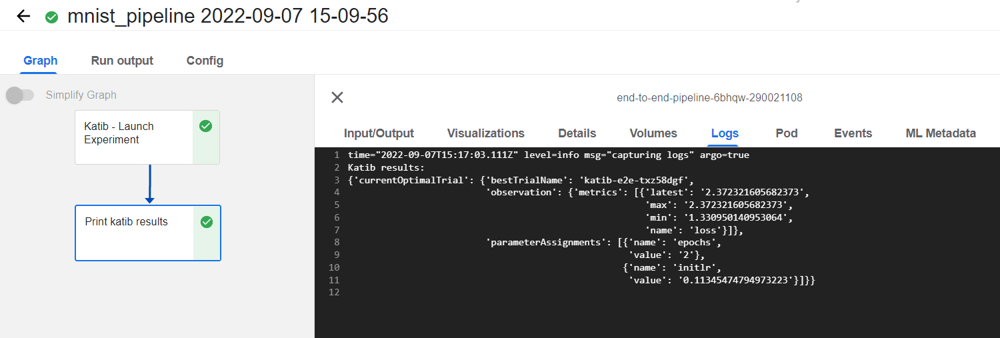
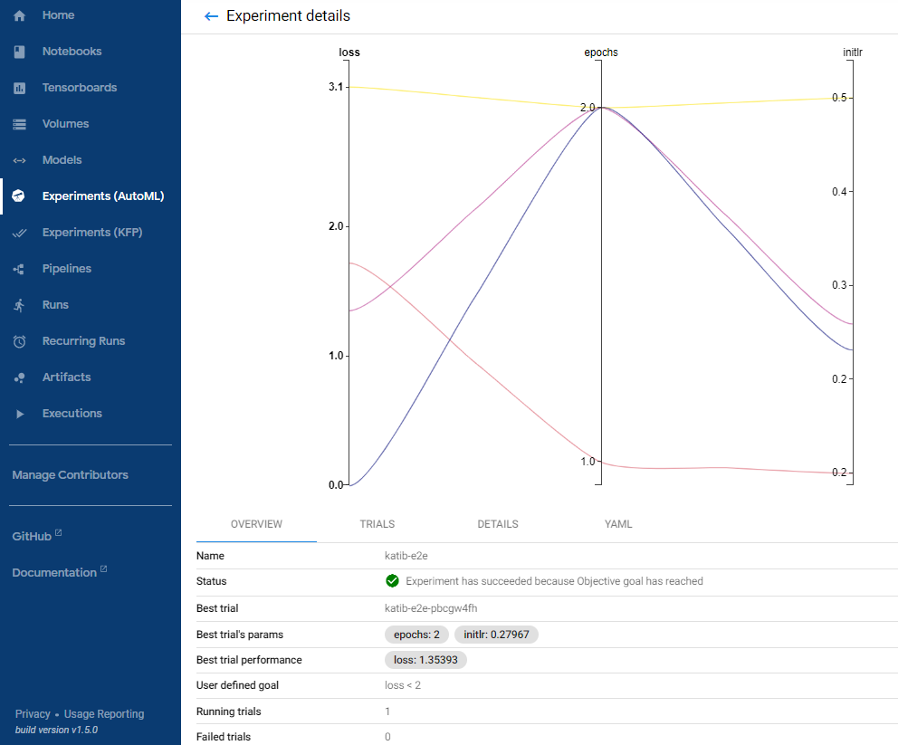
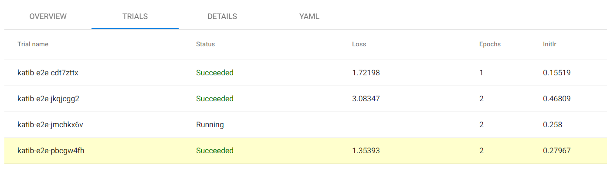

# Katib

Katib is a framework for hyperparameters tuning. It is native to Kubernetes but can also work with RedHat Openshift. \
It includes numerous interesting features such as distributed trials, GPU usage and visualization. \
\
Two examples are in this folder. The first one named **bert_tutorial** is a detailed tutorial for running your first Katib experiment, while the second one named **tfjob** creates the experiment in a different way so that a TFJob can be run afterwards with the optimal parameters.

